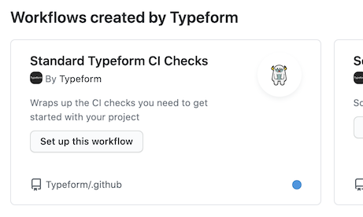

<a href=https://engineering-metrics.typeform.tf/standards-adoption-tool/reports/ci-standard-checks/></a>
<p align="center">
  <a href="https://github.com/Typeform/ci-standard-checks/actions"></a>
</p>

# Continuous Integration Standard Checks

This action is collecting certain standardized checks across the
Typeform organisation in a single central place, so that teams have an
easier time adopting them in their CI and platform teams have an
easier time rolling out new checks to teams. Win-win!

## Included Checks

- `secrets-scan`: make sure you're never ever ever commiting a secret to
  your repo. _Shhh, it's a secret_ :shushing_face:
- `pii-detection`: make sure you're not uploading files with Personal Identifiable
  Information to your repo.
- `validate-openapi`: perform a validation and linting of the openapi.yaml if exists
- `required-typescript`: in JS/TS repositories, make sure only TypeScript is allowed
  for new code and `tsconfig.json` meets minimum typing requirements.

## How to use it

Add this action to your workflow by using the [CI Standard
Checks](https://github.com/Typeform/.github/blob/318bec99ec142dca703ddc78899ee2a788bca236/workflow-templates/ci-standard-checks.yml)
workflow. You can also find it in the workflow templates for your
repo, and it looks like this:



### Skipping Checks

It might be that some of the checks don't make sense for your
particular case. In that case, you can provide `skipChecks` as an
input with the names of the checks you want to skip separated by
commas:

```yaml
---
with:
  skipChecks: 'secret-scan,required-typescript'
```

Refer to the [list of checks](#included-checks) for the proper names
to use.

### Enabling optional Checks

Some checks that are not yet mandatory will be disabled by default; you can opt-in
to them by providing `enableChecks` as an input, just like for [skipping checks](#skipping-checks):

```yaml
---
with:
  enableChecks: 'required-typescript'
```

Refer to the [list of checks](#included-checks) for the proper names
to use.

## Adding new Checks

We use GitHub actions toolkit. See the [toolkit
documentation](https://github.com/actions/toolkit/blob/master/README.md#packages)
for the various packages.

We have a wrapper for `@actions/github` in
`.src/infrastructure/github` that's meant to hold handy helper
methods for accessing data from GitHub that the action might care about
(e.g. info about the PR that triggered the action). They also provide
an extra abstraction layer that is easier to mock in your tests than
pure Octokit. If you need more info from GitHub in your check,
consider adding new [helper
methods](./src/infrastructure/github.ts#L19) to this class instead of
using `@actions/github` directly.

Right now, we support two ways of adding new checks. Typescript and
Bash.

### Typescript Checks

Typescript checks implement the `Check` interface. This is very simple
interface which defines and object with two fields:

- `name` - the name of the check
- `run` - an async function that runs the code of your check

To make your check pass, return a value. To make it fail, throw an
`Error`. The error message will be caught and printed to the action
output.

### Bash Checks

Bash checks are created using the function `bashCheck` from
`./src/checks/bash.ts` like, for example:

```typescript
bashCheck({
  name: 'my-check-name',
  inputs: ['myInput1', 'myInput2'],
})
```

This will create a check called `my-check-name`. To provide it some
code to run, create a `my-check-name` folder inside the `./scripts`
folder and add a `run.sh` script to it. This will be your main
entrypoint, but feel free to add anything else that your script might
need in that folder or break your script into more scripts.

Inputs listed in the check definition will be read using
`core.getInput` from `@actions/core` and passed down to your script
and environment variables in all uppercase. So, following the example,
your `run.sh` script would have two env vars: `MYINPUT1` and
`MYINPUT2` with the values set to whatever you passed to the action in
your workflow file.

## Development Workflow and Releasing

We use
[semantic-release](https://github.com/semantic-release/semantic-release)
to release new versions of the action.

The basics:

- `feat(JIRA-123)` commits will trigger a _minor_ version release
- `fix(JIRA-123)` commits will trigger a _patch_ version release

_Major_ versions are triggered by `BREAKING CHANGE` of `feat!` commits
that should be avoided in general. Engineering Intelligence will plan and coordinate the
cut of new major releases when the time comes.

### Code in Main

> First, you'll need to have a reasonably modern version of `node` handy. This won't work with versions older than 9, for instance.

Install the dependencies

```bash
$ yarn
```

Build the typescript and package it for distribution

```bash
$ yarn run build && yarn run package
```

Run the tests :heavy_check_mark:

```bash
$ yarn test
...
```

### Generate new distribution

Actions are run from GitHub repos so we will checkin the packed dist folder.

Run the following and add the results to your commit:

```bash
$ yarn all
$ git add .
$ git commit -a -m "feat(JIRA-123): New fancy stuff"
$ git push origin JIRA-123-my-branch
```

and make a Pull Request. When it's reviewed and merged, Your action
will be published and a new release will happen automatically! :rocket:

## Validate

There's a [test-and-release-beta.yml](.github/workflows/test-and-release-beta.yml) workflow in the repo
referencing `./` to test the action itself. This will be run to
validate every PR. :white_check_mark:

See the [actions
tab](https://github.com/Typeform/ci-standard-checks/actions) for runs
of this action! :rocket:

## Versioning & Releasing

We're following semver with semantic-release and also following the
major version tag convention for GitHub Actions. The `beta` tag should be
updated automatically as part of the beta release process.

To release to the major version, you can manually trigger the `release` workflow from the actions section of this repo.

See the [GitHub Action versioning
documentation](https://github.com/actions/toolkit/blob/master/docs/action-versioning.md)
for more info about the convention.
